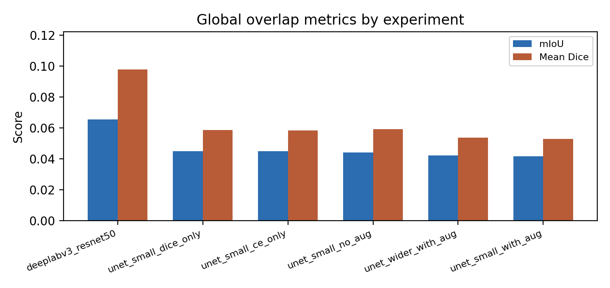
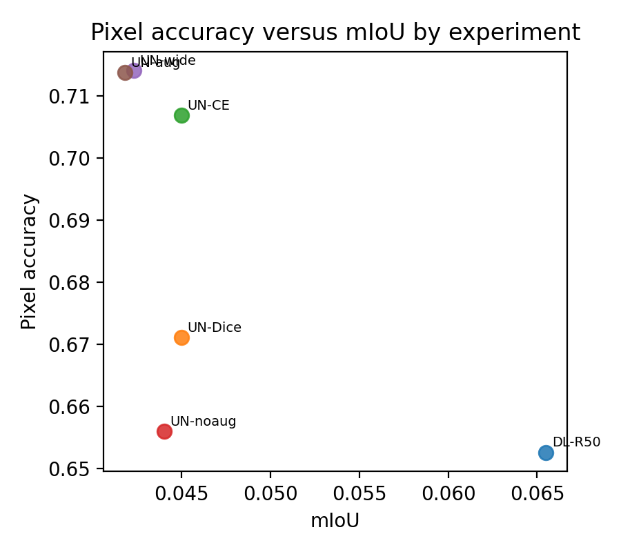
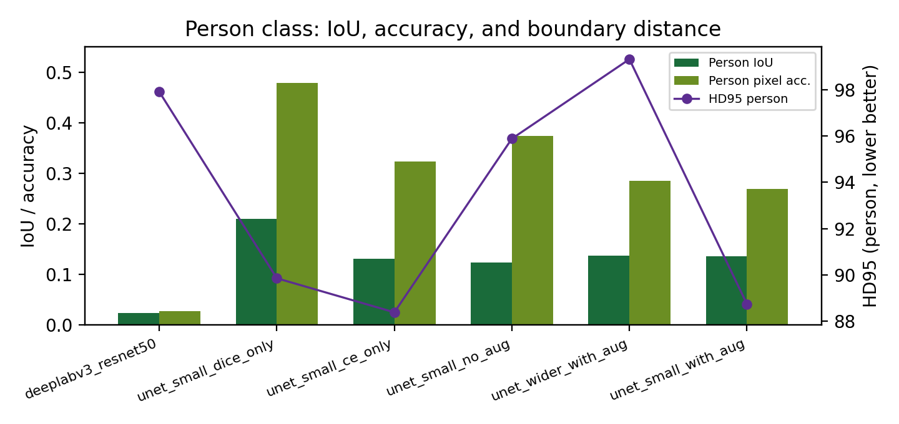
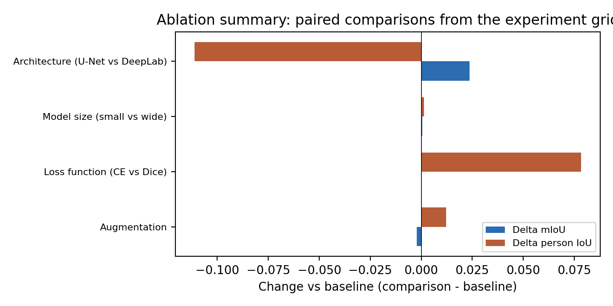
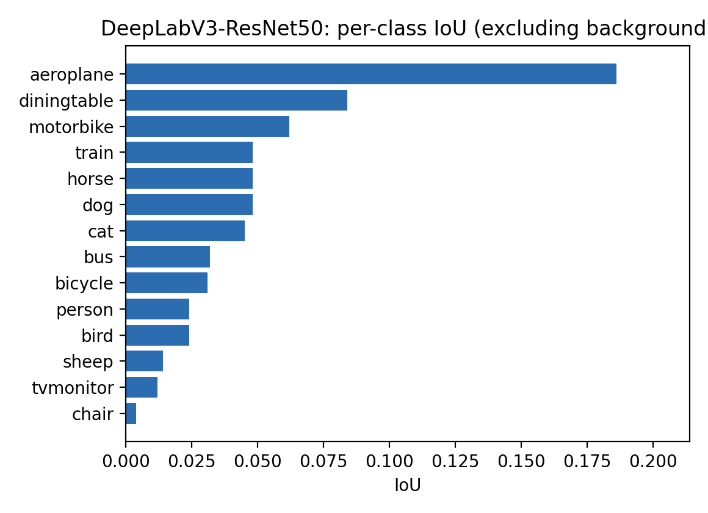
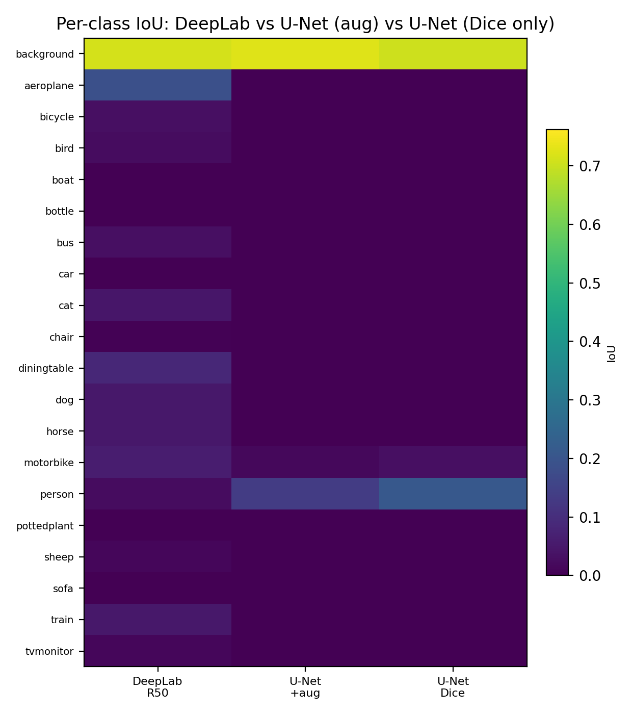

# Introduction

> *Course folklore: mIoU holds a town hall across twenty-one parties; pixel accuracy is a landslide for the background ticket. Both metrics tell stories; they rarely tell the same joke.*

Semantic segmentation assigns each pixel to one of a fixed set of semantic classes. This work reports experiments on the Pascal VOC 2007 segmentation benchmark, comprising twenty object categories and a background class (twenty-one labels in total). Following the course protocol, the official validation split is used as the held-out test set. We compare a custom fully convolutional U-Net to DeepLabV3 with a ResNet-50 backbone implemented in torchvision, and summarize controlled ablations on the U-Net training recipe together with an architecture-wise comparison to the strongest global model in our logs. Supervised metrics and quantitative figures are complemented by qualitative visualizations prepared in the companion notebook. Source code and configuration are summarized in the Software and reproducibility subsection at the end of Methods.

# Methods

## Dataset and splits

Training and evaluation use `torchvision.datasets.VOCSegmentation` with data rooted at `VOCdevkit/VOC2007/`, including JPEG images, indexed train and validation lists under `ImageSets/Segmentation`, and PNG instance-agnostic semantic masks. The reported runs contain 209 training pairs and 213 validation pairs. Each training example consists of an RGB image and a single-channel mask with integer labels in $\{0,\ldots,20\}$, where zero denotes background.

## Preprocessing

Geometric processing applies to image-mask pairs in lockstep. After optional augmentation (training only), images and masks are resized to $256 \times 256$ pixels. Images are resampled with bilinear interpolation; masks use nearest-neighbor interpolation so that class indices remain categorical. RGB images are converted to floating-point tensors and normalized with ImageNet statistics (mean $[0.485, 0.456, 0.406]$, standard deviation $[0.229, 0.224, 0.225]$). Masks are represented as 64-bit integers and cast to long tensors for dense classification losses.

## Data augmentation

When enabled on the training set only, the pipeline applies a horizontal flip to both modalities with probability 0.5. With probability 0.6, a random affine transform is applied (rotation within approximately $\pm 10^\circ$, translation up to about five percent of the spatial extent, scale in $[0.9,1.1]$, shear within approximately $\pm 5^\circ$). Images use bilinear warping; masks use nearest-neighbor warping, with out-of-range locations assigned the ignore index 255 so that void regions can be excluded from the loss where supported. Photometric jitter (brightness and contrast, each with probability 0.35; saturation with probability 0.2) is applied to images alone so that label semantics are unchanged.

## Class imbalance and optimization

For cross-entropy training, class frequencies estimated from training masks (excluding ignore pixels) can be used to reweight the loss and mitigate gradient domination by background. Dice-based objectives emphasize set overlap and are less directly tied to per-pixel frequency weighting. Optimization uses batch size four for fifteen epochs, learning rate $5 \times 10^{-4}$, weight decay $1 \times 10^{-4}$, mixed-precision arithmetic when available, and gradient clipping.

## Architectures

The U-Net variant is an encoder-decoder with skip connections producing twenty-one output channels at full resolution. Narrow and wide configurations differ in channel width. DeepLabV3-ResNet50 combines a ResNet-50 encoder with an atrous spatial pyramid pooling module and a dense prediction head. In the reported experiments, DeepLabV3-ResNet50 attains the highest mean intersection-over-union (mIoU). A full factorial ablation grid for DeepLab (e.g., augmentation on and off) was not completed under the same compute budget; DeepLab is therefore treated primarily as a fixed high-capacity reference. The notebook additionally documents an optional Segment Anything Model 2 pathway based on prompted instance segmentation; quantitative comparison to dense twenty-one-way prediction is out of scope when checkpoints or dependencies are unavailable.

## Ablation protocol

Pairwise comparisons isolate single factors where possible: (i) augmentation off versus on for the small U-Net; (ii) cross-entropy-only versus Dice-only training for the small U-Net without augmentation; (iii) narrow versus wide U-Net with augmentation enabled; (iv) small U-Net with augmentation versus DeepLabV3-ResNet50 as an architecture comparison relative to the best mIoU model in the study.

## Evaluation metrics

We report mIoU and mean Dice coefficient averaged over classes with valid support, overall pixel accuracy, per-class IoU where exported, and pixel accuracy restricted to the person class. For the person category we additionally report the 95th percentile Hausdorff distance (HD95) between predicted and reference binary person masks, with lower values indicating closer boundary agreement. Qualitative assessment uses mosaic layouts (image, ground truth, prediction) and ranked examples by per-image person IoU.

## Software and reproducibility

Experiments are implemented in PyTorch. Source code, the primary notebook, training script, metric exports, and figure-generation utilities are maintained at https://github.com/Qiayi0815/shbt_miniproject2 . Representative paths in that repository include `notebooks/mini_project_2_pascal_voc_segmentation (1) (4).ipynb`, `notebooks/train.py`, and `artifacts/report_exports/`. Version-controlled releases omit multi-hundred-megabyte checkpoints and raw VOC archives; regenerate weights locally after placing the dataset under the configured root.

```{=latex}
\paragraph{Author note.}
\textit{If a tensor ever asks whether it is ``learning'' or ``memorizing the sky,'' answer diplomatically and check your validation augmentations.}
```

# Results

All metrics below are computed on the Pascal VOC 2007 validation masks used as test data. Figures and tables are referenced in the order they appear.

{width=95%}

Figure 1 summarizes global overlap: DeepLabV3-ResNet50 attains the tallest bars on both mIoU and mean Dice (0.0655 and 0.0978), while U-Net runs occupy a lower band on mIoU yet remain competitive on mean Dice only for select configurations. The figure therefore previews the central architectural gap before tabulating complementary quantities.

{width=62%}

Figure 2 makes the decoupling explicit: several U-Nets sit to the **right** of DeepLab on pixel accuracy but to the **left** on mIoU, which is the hallmark of majority-class agreement without balanced per-class overlap. DeepLab occupies the upper-left quadrant relative to those points, trading a few percentage points of pixel accuracy for higher mIoU.

**Table 1.** Quantitative segmentation metrics. Pixel accuracy, mIoU, mean Dice, person IoU, and person pixel accuracy are fractions in $[0,1]$ except HD95 (person), for which lower values indicate better boundary agreement. Validation loss is included for completeness; values are not directly comparable between Dice-only and cross-entropy runs.

| Experiment | Pixel acc. | mIoU | Mean Dice | HD95 (person) | Person IoU | Person acc. | Val loss |
|:--|--:|--:|--:|--:|--:|--:|--:|
| deeplabv3_resnet50 | 0.653 | **0.0655** | **0.0978** | 97.91 | 0.024 | 0.027 | 2.57 |
| unet_small_dice_only | 0.671 | 0.0450 | 0.0587 | 89.86 | **0.210** | **0.479** | **0.82** |
| unet_small_ce_only | **0.707** | 0.0450 | 0.0585 | **88.38** | 0.132 | 0.323 | 2.57 |
| unet_small_no_aug | 0.656 | 0.0440 | 0.0591 | 95.89 | 0.123 | 0.374 | 3.41 |
| unet_wider_with_aug | **0.714** | 0.0423 | 0.0538 | 99.32 | 0.137 | 0.285 | 3.40 |
| unet_small_with_aug | 0.714 | 0.0418 | 0.0530 | 88.74 | 0.135 | 0.270 | 3.44 |

Table 1 states the same rankings numerically. DeepLab leads mIoU and mean Dice. The Dice-only U-Net attains the largest person IoU (0.210) and person pixel accuracy (0.479), whereas the cross-entropy-only U-Net attains the lowest HD95 among U-Net variants (88.38). DeepLab records a low person IoU (0.024) in this fifteen-epoch snapshot despite leading global overlap, which motivates joint reporting of summary and class-specific evidence. Validation loss is lowest for Dice-only training (0.82) but scales differently under cross-entropy (e.g., 2.57 for DeepLab and CE-only U-Net).

{width=95%}

Figure 3 isolates the **person** axis of Table 1: Dice training elevates both person IoU and person pixel accuracy, CE-only minimizes HD95 among U-Nets, and DeepLab's HD95 and person IoU remain modest here relative to its global mIoU lead.

**Table 2.** Paired ablation effects (comparison minus baseline). HD95 is on the person mask (lower $\Delta$ is better).

| Ablation | Baseline | Comparison | $\Delta$ mIoU | $\Delta$ person IoU | $\Delta$ HD95 (person) |
|:--|:--|:--|--:|--:|--:|
| Augmentation | unet_small_no_aug | unet_small_with_aug | -0.0022 | +0.0121 | -7.15 |
| Loss (CE vs Dice) | unet_small_ce_only | unet_small_dice_only | 0.0000 | +0.0783 | +1.47 |
| Model width | unet_small_with_aug | unet_wider_with_aug | +0.0006 | +0.0013 | +10.58 |
| Architecture | unet_small_with_aug | deeplabv3_resnet50 | **+0.0237** | -0.1111 | +9.17 |

Augmentation reduces mIoU slightly ($-0.0022$) while improving person IoU ($+0.0121$) and HD95 ($-7.15$). Replacing cross-entropy with Dice leaves mIoU unchanged at printed precision but raises person IoU by $0.0783$ with a small HD95 penalty ($+1.47$). Width scaling is nearly neutral on mIoU and person IoU yet raises HD95 by $10.58$. The architecture row carries the largest mIoU gain ($+0.0237$) together with a person IoU drop ($-0.1111$) and higher HD95 ($+9.17$), summarizing the trade-off between balanced multi-class segmentation and person overlap under a fixed schedule.

{width=95%}

Figure 4 re-expresses Table 2 for the two overlap summaries: augmentation and architecture move person IoU and mIoU in different directions, whereas the loss swap shifts person IoU strongly with a near-zero mIoU delta at three decimal places.

{width=72%}

Figure 5 lists every non-background class for which DeepLab achieves non-negligible IoU in our export, emphasizing breadth rather than a single foreground mode.

{width=62%}

Figure 6 contrasts **dense** versus **sparse** per-class structure: DeepLab shows energy across many rows, whereas the two U-Net columns are darker outside person and a few incidental classes, matching the narrative of background-heavy U-Net predictions with selective foreground peaks.

Dense prediction **mosaics** (image, ground truth, prediction) and **best- versus worst-case** person examples ranked by per-image person IoU remain in the companion notebook; export them for the submission PDF if required as qualitative figures.

# Discussion

Pixel accuracy is dominated by correct background predictions; consequently, it can increase when the model becomes more confident on easy majority regions even as rare-class IoU stagnates. Mean IoU penalizes such imbalance because it averages overlap across categories. Figure 2 visualizes this decoupling directly; Table 1 supplies the underlying numbers. DeepLabV3-ResNet50 widens the effective receptive field and fuses multi-scale context prior to upsampling, which favors recovery of diverse object categories and aligns with the spread of non-zero per-class IoU in Figures 5 and 6. Under the same resolution and epoch budget, compact U-Nets more often concentrate evidence in background and a limited set of foreground modes, as shown by the sparse columns in Figure 6 and by the per-class exports summarized there.

Absolute mIoU values remain modest at $256 \times 256$ resolution with fifteen training epochs. Downsampling removes fine structures that remain semantically salient at full scale, and class imbalance continues to bias gradients toward safe dominant-class predictions. Within this constrained regime, relative ordering between architectures and training objectives remains informative.

The Dice-trained U-Net improves person IoU relative to cross-entropy at essentially fixed mIoU, consistent with overlap-based losses emphasizing foreground agreement. Cross-entropy with class reweighting optimizes a per-pixel softmax and, in these logs, attains the strongest person HD95 among U-Nets, indicating complementary behavior between overlap-based and likelihood-based training signals. Hausdorff metrics are sensitive to thin structures; small boundary displacements can alter HD95 substantially.

Augmentation slightly reduces mIoU in the paired comparison while improving person-centric measures. Geometric perturbations reduce reliance on fixed poses and crops yet can increase effective difficulty for infrequent classes that already receive limited supervision. Given finite epochs, mean summaries can move in opposite directions to class-specific indices without inconsistency.

Increasing channel width without revisiting learning rate or regularization leaves mIoU and person IoU nearly unchanged while degrading HD95, which is compatible with optimization difficulty or texture overfitting when capacity grows. Architectural substitution from the augmented small U-Net to DeepLabV3-ResNet50 produces the dominant mIoU improvement, supporting the primacy of inductive bias and receptive field over marginal width changes. The concurrent drop in person IoU for DeepLab relative to the Dice-trained U-Net reflects competition for representational capacity across twenty foreground classes within the same training horizon; additional training or auxiliary person supervision would be reasonable avenues to reconcile global and class-specific goals.

Nearest-neighbor mask resizing preserves label integrity but can alias thin objects at coarse resolution, contributing to missing rare classes in mIoU rather than indicating label corruption. ImageNet normalization stabilizes optimization for architectures designed around pretrained statistics.

This study does not claim state-of-the-art VOC performance; it documents controlled comparisons under a single preprocessing and schedule choice. Optional SAM-based pipelines are not evaluated here as dense twenty-one-way semantic competitors. Natural extensions include higher-resolution training, longer schedules with decay, test-time augmentation, and DeepLab-specific loss and augmentation ablations.

# Conclusion

We presented a reproducible comparison of custom U-Net variants and DeepLabV3-ResNet50 on Pascal VOC 2007 with paired resizing, nearest-neighbor label warping, ImageNet normalization, and optional geometric and photometric augmentation. DeepLabV3-ResNet50 achieved the strongest mIoU and mean Dice, with broad non-background activation in per-class IoU. Dice-only U-Net training yielded the strongest person IoU and person pixel accuracy, whereas augmentation improved person HD95 despite a small negative change in mIoU in the logged pair. Architecture choice outweighed modest width scaling for global metrics, while the loss objective materially shaped person-centric outcomes. Qualitative material in the companion notebook completes the empirical record. No rubber ducks were harmed during debugging; several convolution kernels may still be questioning their life choices.

```{=latex}
\newpage
```

# References

1. Everingham, M., Van Gool, L., Williams, C. K. I., Winn, J., Zisserman, A. The PASCAL Visual Object Classes Challenge 2007 (VOC2007) results.

2. Ronneberger, O., Fischer, P., Brox, T. U-Net: Convolutional Networks for Biomedical Image Segmentation. In: Medical Image Computing and Computer-Assisted Intervention (MICCAI), 2015.

3. Chen, L.-C., Papandreou, G., Schroff, F., Adam, H. Rethinking Atrous Convolution for Semantic Image Segmentation. arXiv:1706.05587, 2017.

4. Kirillov, A., et al. Segment Anything. In: IEEE/CVF International Conference on Computer Vision (ICCV), 2023.
